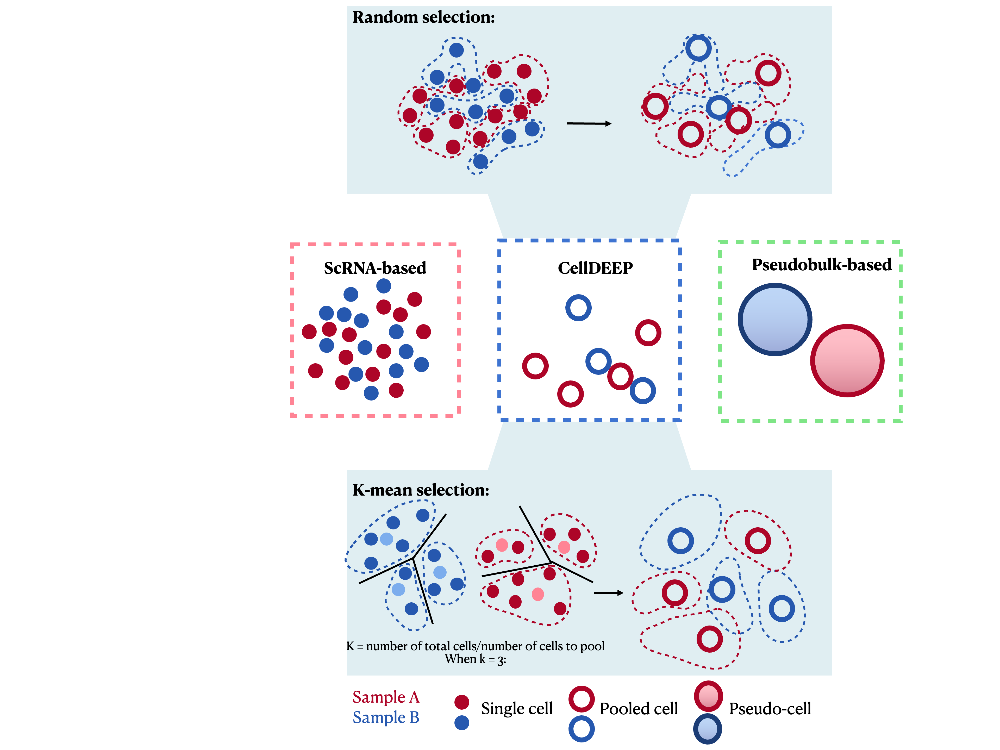

<!-- README.md is generated from README.Rmd. Please edit that file -->

# CellDEEP

<!-- badges: start -->

<!-- badges: end -->

## Introduction to CellDEEP

Single-cell RNA sequencing (scRNA-seq) allows us to explore gene
expression at an unprecedented resolution, but it faces significant
challenges like high dropout rates and data sparsity. CellDEEP was
developed to bridge the gap between robust but coarse pseudobulk methods
and sensitive but potentially biased single-cell methods.

<figure>

<figcaption aria-hidden="true">CellDEEP overview</figcaption>
</figure>

Check our paper for details:
https://www.biorxiv.org/content/10.64898/2026.03.09.710522v1

## Installation

You can install the CellDEEP from CRAN:

``` r
install.packages("CellDEEP")
```

## Example

Before using, don’t forget library it:

``` r
library(CellDEEP)
```

### Vignette:

- [Tutorial
  vignette](https://sii-scrna-seq.github.io/CellDEEP/articles/CellDEEP_vignette.html)

To quickly run CellDEEP, pass your metadata column names directly into
`FindMarker.CellDEEP`:

``` r
data("sim")

# Pool defaults to TRUE
de.test <- FindMarker.CellDEEP(sim, 
                          group_id = "Status", 
                          sample_id = "DonorID", 
                          cluster_id = "cluster_id",
                          Pool = TRUE,
                          test.use = "wilcox", 
                          n_cells = 3, 
                          min_cells_per_subgroup = 1,
                          cell_selection = "random", 
                          readcounts = "sum", 
                          logfc.threshold = 0.25, 
                          ident.1 = "Case", 
                          ident.2 = "Control")
```

This section introduce what is updated.

For version 1.0.1:  
1. FindMarker.CellDEEP Pool default should be TRUE.  
2. Not clear what is cell_cutoff, replaced with new parameter  
3. Change “pool_way” to cell_selection  
4. Vignette easy to access/read  
5. Change toy data to simulated data, will generate DE result now.  

For publish version(1.0.0):  
Delete code used for experiment, keep only CellDEEP function code.  
Delete all the comments, clean the code.  
Rename pooling function as CellDEEP.Kmean and CellDEEP.Random.  
